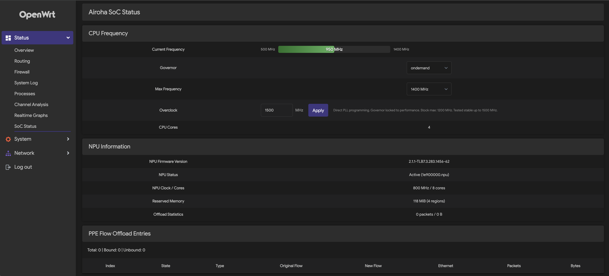

# luci-app-airoha-npu

LuCI status page for Airoha AN7581 SoC on OpenWrt. Covers CPU frequency control, NPU monitoring, and PPE flow offload.



## Features

### CPU Frequency
- Live frequency bar with real-time polling
- Governor selection (ondemand, performance, powersave, etc.)
- Max frequency control via OPP table (500-1400 MHz)
- Direct PLL overclock up to 1600 MHz via devmem (bypasses cpufreq)
- Overclock detection -- bar turns orange with (OC) label when running above OPP max

### NPU
- Firmware version (TLB format)
- NPU load status and device binding
- Clock speed and core count (8 RISC-V cores)
- Reserved memory regions with sizes

### PPE Flow Offload
- Real-time PPE flow entries table (state, type, original/new flow, ethernet)
- Per-flow packet and byte counters
- Bound/unbound flow summary

## Installation

### From OpenWrt Feeds

```bash
cp -r luci-app-airoha-npu feeds/luci/applications/
./scripts/feeds update luci
./scripts/feeds install luci-app-airoha-npu
make menuconfig  # LuCI -> Applications -> luci-app-airoha-npu
make package/feeds/luci/luci-app-airoha-npu/compile
```

### Manual Install

```bash
scp root/usr/libexec/rpcd/luci.airoha_npu root@router:/usr/libexec/rpcd/
scp root/usr/share/luci/menu.d/luci-app-airoha-npu.json root@router:/usr/share/luci/menu.d/
scp root/usr/share/rpcd/acl.d/luci-app-airoha-npu.json root@router:/usr/share/rpcd/acl.d/
scp htdocs/luci-static/resources/view/airoha_npu/status.js root@router:/www/luci-static/resources/view/airoha_npu/
ssh root@router "chmod +x /usr/libexec/rpcd/luci.airoha_npu && /etc/init.d/rpcd restart"
```

## Requirements

- OpenWrt with LuCI on Airoha AN7581
- PPE debugfs enabled (`/sys/kernel/debug/ppe/entries`)
- `devmem` for overclock feature

## Notes

- Governor and max frequency changes are **not persistent** across reboot
- Overclock writes PLL registers directly -- same method as ATF BL31 `en7523_armpll_set()`
- Frequencies above 1400 MHz may be unstable at stock voltage (~640 mV)
- OPP table supports 500-1400 MHz in 50 MHz steps (levels 0-18)

## License

Apache-2.0
